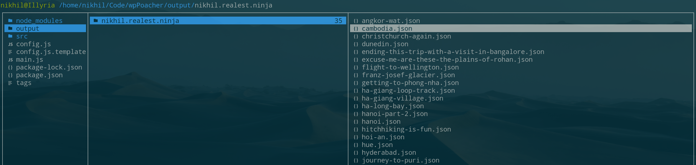
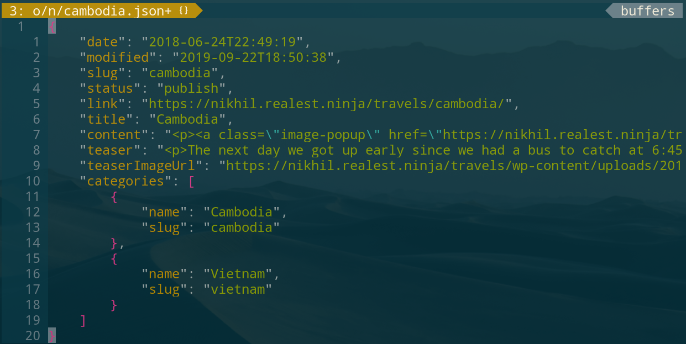

# wpPoacher

This script will fetch blog entries from a WordPress blog by using the WordPress API.

## Preview

### Filestructure


It will create a folder in your output folder, named after the domain.

### Blog entries in JSON file format



It will then create a JSON file for each blog entry inside your domain folder.

## Requirements:

* [nodejs](https://nodejs.org/)

## Usage

* Clone this repository: `git clone https://github.com/realestninja/wpPoacher.git`
* `npm i` to install the dependencies.
* Adjust the `config.js.template` file and rename it to `config.js`
* `npm start`

## Configuration

### host

`host` needs to be your WordPress base url.

### postParamsToBeDeleted
The WordPress API response has a lot of information that might not be needed. The parameters that shall not end up in the output file can be specified in this array.
Example:
```
const postParamsToBeDeleted = [
  "id",
  "guid",
  "date_gmt",
  "modified_gmt",
  "type",
  "author",
  "comment_status",
  "ping_status",
  "sticky",
  "template",
  "format",
  "meta",
  "tags",
  "_links",
  "featured_media",
];
```

### saveSettings
The `saveSettings` object allows for setting up different ways of saving the content.
Example:
```
const saveSettings = {
  saveInSeparateFolders: false,
  useGenericJsonFileName: false,
};
```

If `saveInSeparateFolders` is set to `true`, it will create a folder for each blog entry where the JSON will be saved. Setting it to `false` will put all JSON files into the same base folder.

If `useGenericJsonFileName` is set to `true`, the output JSON will be named `content.json` instead of having the WordPress slug as filename.

### teaserImageSettings

The `teaserImageSettings` allow to save the image url or even the whole image that was set as a teaser image for a blog post.
Example:
```
const teaserImageSettings = {
  saveMedia: false,
  saveUrl: true,
};
```

* `saveMedia` will download each image
* `saveUrl` will just save the url of the image
